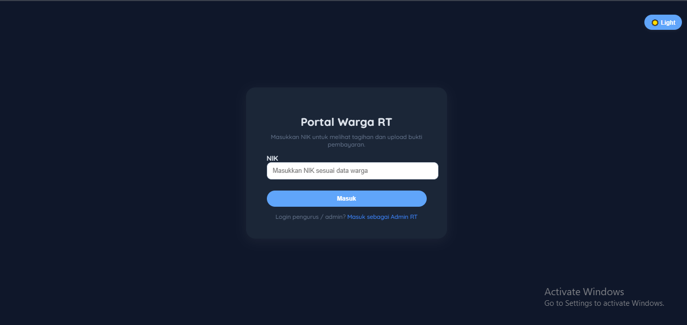
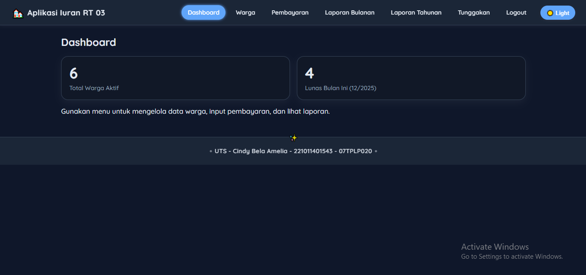
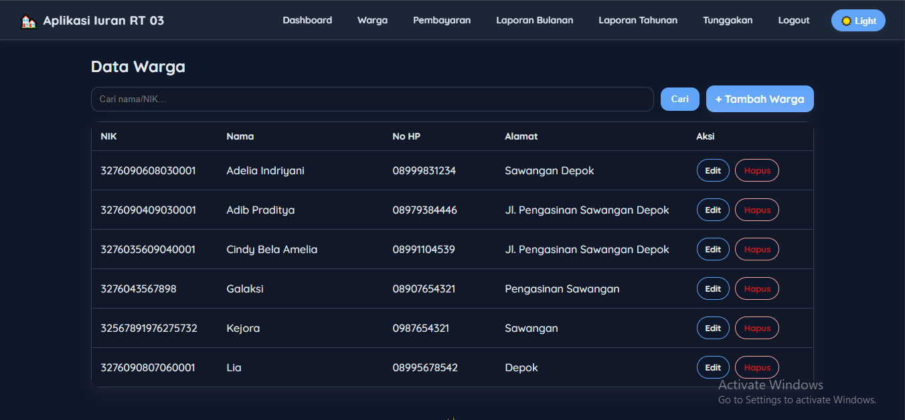
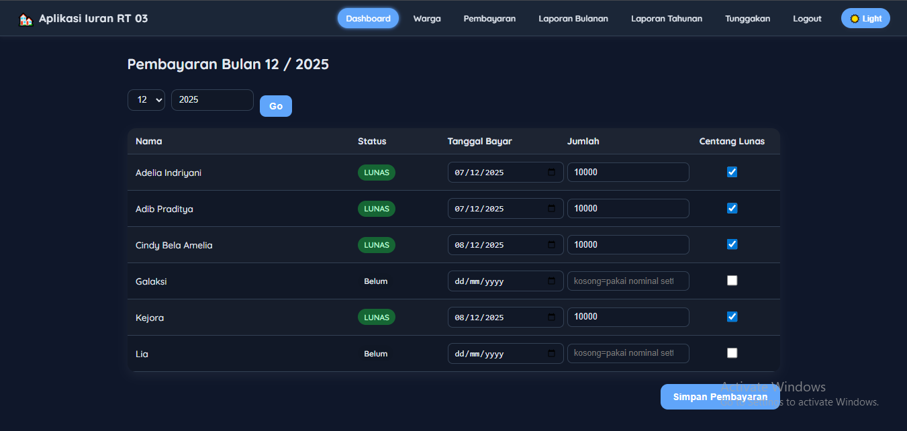
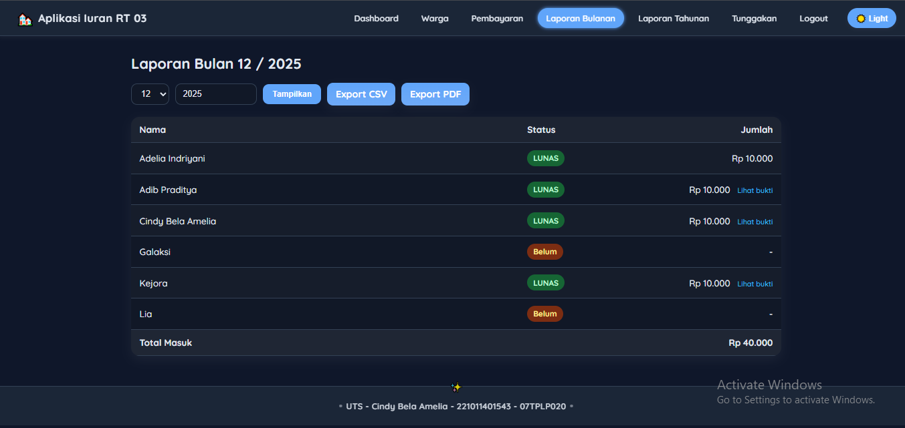
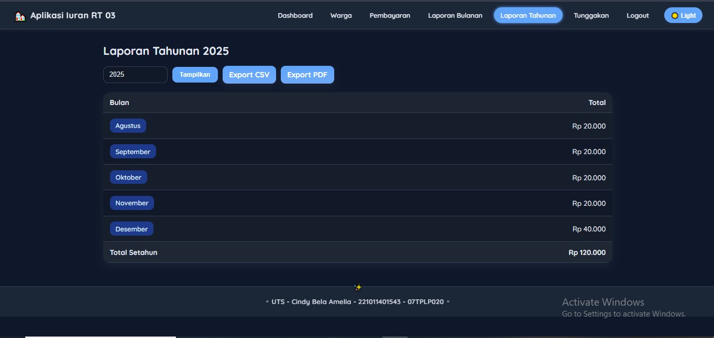
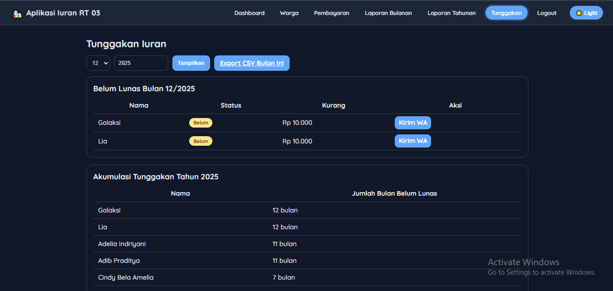

# Cindy Bela Amelia - 221011401543 - 07TPLP020

# Sistem Informasi Iuran RT

## 📌 Deskripsi Proyek

Sistem Informasi **Iuran RT** adalah aplikasi berbasis web menggunakan **PHP** dan **MySQL** yang digunakan untuk mengelola data warga, tagihan iuran, serta pembayaran iuran RT secara terstruktur dan terdokumentasi. Aplikasi ini mendukung proses unggah bukti pembayaran dan pembuatan laporan, termasuk ekspor dokumen menggunakan **TCPDF**.

Aplikasi ini cocok digunakan oleh pengurus RT untuk mempermudah administrasi iuran bulanan dan oleh warga untuk melihat tagihan serta riwayat pembayaran mereka.

---

## 🧰 Teknologi yang Digunakan

* **Bahasa Pemrograman**: PHP (Native)
* **Database**: MySQL / MariaDB
* **Web Server**: Apache (XAMPP / Laragon)
* **Frontend**: HTML, CSS
* **Library Tambahan**: TCPDF (untuk generate PDF)

---


### Cara Import Database:

1. Buka **phpMyAdmin**
2. Buat database baru, misalnya: `iuran_rt`
3. Import file `iuran_rt.sql`
4. Pastikan konfigurasi koneksi database di file PHP sudah sesuai

---

## Login Admin
- Username: `admin`
- Password: `admin123`

---

## 🚀 Cara Menjalankan Aplikasi

1. Pindahkan folder `iuran-rt` ke:

   ```
   C:\xampp\htdocs\
   ```
2. Jalankan **Apache** dan **MySQL** melalui XAMPP
3. Import database
4. Buka browser dan akses:

   ```
   http://localhost/iuran-rt/
   ```

---

## 👥 Hak Akses Pengguna

### 🔹 Warga

* Login ke sistem
* Melihat tagihan iuran
* Upload bukti pembayaran
* Melihat riwayat pembayaran

### 🔹 Admin / Pengurus RT

* Mengelola data warga
* Melihat seluruh pembayaran
* Mengecek bukti pembayaran
* Mencetak laporan (PDF)

---

# 🎨 Tampilan Aplikasi (User Interface)

Bagian ini menjelaskan tampilan antarmuka (UI) pada aplikasi Sistem Informasi Iuran RT, beserta fungsi dari masing-masing halaman.

### 1️⃣ Halaman Login Warga



Deskripsi:
Halaman ini digunakan oleh warga untuk masuk ke dalam sistem dengan menggunakan akun masing-masing. Login diperlukan agar warga hanya dapat mengakses data iuran miliknya sendiri.

Fungsi Utama:
    . Input NIK warga
    . Autentikasi data warga
    . Mengarahkan warga ke portal/dashboard warga

### 2️⃣ Dashboard Warga


Deskripsi:
Halaman dashboard warga merupakan halaman utama setelah warga berhasil login. Halaman ini menampilkan ringkasan informasi iuran dan menu navigasi utama.

Informasi yang Ditampilkan:
    . Identitas warga
    . Informasi status iuran
    . Akses ke menu pembayaran dan riwayat


### 3️⃣ Halaman Login Admin


Deskripsi:
Halaman login admin digunakan oleh pengurus RT untuk masuk ke sistem sebagai administrator.

Fungsi Utama:
    . Input username dan password admin
    . Autentikasi admin
    . Akses ke dashboard admin

### 4️⃣ Dashboard Admin



Deskripsi:
Dashboard admin menampilkan ringkasan data utama sistem iuran RT secara keseluruhan.

Fitur:
    . Ringkasan jumlah warga
    . Informasi total pembayaran
    . Akses cepat ke menu pengelolaan data

### 5️⃣ Data Warga (Admin)



Deskripsi:
Halaman ini digunakan oleh admin untuk mengelola data warga yang terdaftar dalam sistem.

Fungsi:
    . Menambah data warga
    . Mengedit data warga
    . Menghapus data warga
    . Melihat daftar warga

### 6️⃣ Data Pembayaran (Admin)



Deskripsi:
Halaman ini menampilkan seluruh data pembayaran iuran warga yang telah masuk ke sistem.

Fitur:
    . Melihat daftar pembayaran
    . Mengetahui status pembayaran
    . Verifikasi bukti pembayaran warga


### 7️⃣ Laporan Bulanan



Deskripsi:
Halaman laporan bulanan digunakan untuk melihat dan mencetak laporan pembayaran iuran berdasarkan bulan tertentu.

Fungsi:
    . Rekap pembayaran bulanan
    . Cetak laporan dalam bentuk PDF
    . Monitoring pemasukan iuran


### 8️⃣ Laporan Tahunan




Deskripsi:
Halaman ini menyajikan laporan pembayaran iuran warga dalam satu periode tahun.

Fungsi:
    . Rekap pembayaran tahunan
    . Analisis pemasukan iuran RT
    . Export laporan ke PDF


### 9️⃣ Laporan Tunggakan




Deskripsi:
Halaman laporan tunggakan digunakan untuk melihat daftar warga yang belum melunasi iuran.

Fungsi:
    . Menampilkan warga dengan tunggakan
    . Monitoring iuran yang belum dibayar
    . Membantu penagihan oleh pengurus RT

---

> 📸 Semua screenshot diambil dari localhost (XAMPP) versi final project UTS Pemrograman Web 2  


